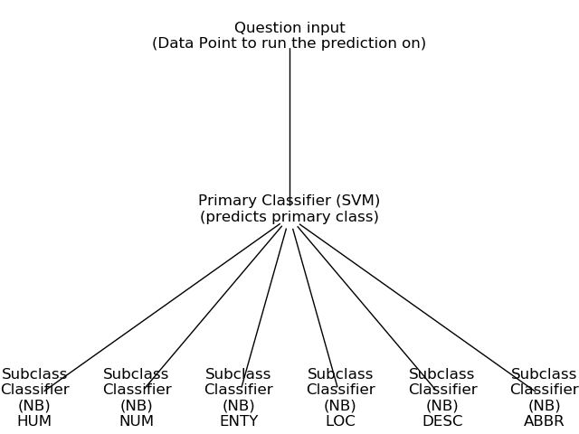

# intent-classification

finding the intent of a question using the following classification hierarchy 

## Building the Hierarchy Model
* Each line of the training data looks like 
```
DESC:manner How did serfdom develop in and then leave Russia ?
```
* This translates as 
```
primary class : DESC 
sub class : manner 
question(datapoint) : How did serfdom develop in and then leave Russia ?
```
* In this dataset there are total of 6 primary classes ('ABBR', 'DESC', 'ENTY', 'HUM', 'LOC', 'NUM') and 50 subclasses
* train/test split is done using sklearn (80 and 20 split)

#### Initial (Naive) Approach
* Since all the subclasses are unique I ran a Naive Bayes classifier to predict the subclass on test dataset ,the test accuracy achieved is 64%
* There is clear room for improvement which lead to building of hierarchy model

#### Hierarchy Model

* Utilising the hierarchy of classes in the dataset , we first train a Naive Bayes classifier to predict primary classes 
* The test accuracy achieved in this step is 91%
* Ultilising an SVM classifier here instead of Naive Bayes achieved a test accuracy of 97%
* Now we train separate classifiers on each primary class to predict the subclass. 
* I used Naive Bayes classifier for subclass classification since the data under each subclass is limited.
* The hierarchy is as shown below

* final test accuracy achieved from the hierarchy model is 85%

#### Data Processing
* each datapoint is taken as a vector of TFIDF values using the following Pipeline function
```
 Pipeline([('vect', CountVectorizer(stop_words={'english'})), ('tfidf', TfidfTransformer()), ('clf', LinearSVC())])
```

* Please install the requirements from requirement.txt file 


#### Commands
1) Train the model:
```
python run_train.py -f {"training_file_path"}
```

* Once the run_train file is run models are saved to [models folder](models)

2) Run the model on new data point (question) to make a prediction:
```
python run_model.py -s {"type question here"}
```

#### Results
| Model Type  | Primary classifier(6 classes) | Secondary classifier(Subclasses)  | Test Accuracy |
| ------------- | ------------- | ------------- | ------------- |
| Naive Approach  | Not Applicable  | Naive Bayes  | 64%  | 
| Hierarchical Approach  | Naive Bayes  | Naive Bayes  | 80%  |
| Hierarchical Approach  | SVM  | Naive Bayes  | 85%  |
